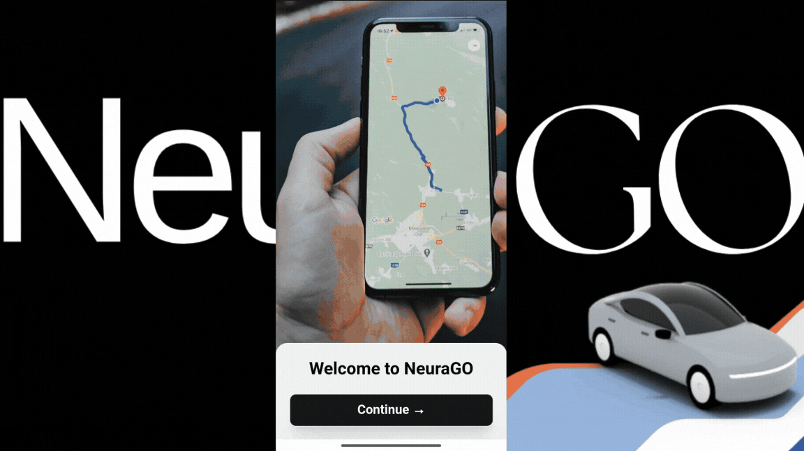

<div align="center">
	
	<h1>NeuraGo - Smart Urban Mobility</h1>
	<p><strong>Connect Riders with Drivers in Real-Time</strong></p>
</div>

# 🚗 NeuraGO - Modern Ride-Hailing Platform


NeuraGo is a cutting-edge ride-hailing platform that connects passengers with drivers for seamless urban transportation. Built with modern technologies, it offers real-time tracking, secure payments, and an intuitive user experience for both riders and drivers.

### ✨ Key Features

- 🔐 Secure user authentication and authorization
- 📍 Real-time location tracking
- 💰 Secure payments using Razorpay
- 📱 Responsive and mobile-friendly interface
- 🚗 Driver-passenger matching algorithm
- ⭐ Rating and review system

## 🛠️ Tech Stack

- **Backend**: Node.js, Express.js, MongoDB
- **Frontend**: React.js
- **Authentication**: JWT
- **Real-time Updates**: Socket.io
- **Maps**: Google Maps API

## 📁 Project Structure

```NeuraGO/
├── Backend/
│   ├── controllers/     # Request handlers and business logic
│   ├── models/         # MongoDB schema definitions
│   ├── routes/         # API route definitions
│   ├── middleware/     # Custom middleware functions
│   ├── utils/          # Helper functions and utilities
│   └── server.js       # Main server file
├── Frontend/
│   ├── src/
│   │   ├── components/ # Reusable UI components
│   │   ├── pages/      # Page components
│   │   ├── services/   # API integration services
│   │   ├── context/    # React context providers
│   │   ├── hooks/      # Custom React hooks
│   │   └── utils/      # Helper functions
│   └── index.jsx       # Entry point
└── README.md
```

### 📱 Application Flow

## User Journey
1. Registration/Login: Create account or sign in
2. Location Selection: Enter pickup and destination
3. Ride Selection: Choose vehicle type and view fare
4. Booking: Confirm ride details
5. Matching: Wait for driver assignment
6. Tracking: View driver approach and ride progress
7. Payment: Complete payment after ride

## Driver Journey
1. Registration/Login: Create account or sign in
2. Status Activation: Go online to receive requests
3. Request Reception: View and accept ride requests
4. Navigation: Navigate to pickup location
5. Ride Execution: Transport passenger to destination
6. Completion: Finish ride and receive payment
7. History: View completed rides and earnings

## ✨ Features

### 🧍 For Riders
- **Location-based Booking**: Search and select pickup and destination locations
- **Vehicle Selection**: Choose from multiple vehicle types (car, auto, bike)
- **Real-time Tracking**: Track your driver's location and ETA
- **Fare Estimation**: Get upfront fare calculations
- **Ride History**: Access past ride details and receipts
- **Secure Payments**: Multiple payment options

### 🚘 For Drivers
- **Real-time Ride Alerts**: Receive nearby ride requests instantly
- **Intelligent Matching**: Connect with riders in your vicinity
- **Navigation**: Built-in directions to pickup and destination
- **Earnings Tracking**: Monitor your earnings in real-time
- **Status Management**: Toggle availability as needed

### 🔐 Security Features
- **JWT Authentication**: Secure API endpoints
- **Token Blacklisting**: Prevent token reuse after logout
- **Password Hashing**: Bcrypt for secure password storage
- **Input Validation**: Sanitize and validate all inputs
- **Secure Socket Connection**: Authenticated real-time communication

## 🔧 Configuration

### Backend Configuration

Required environment variables for the backend:

- `PORT`: Server port (default: 3000)
- `MONGO_URL`: MongoDB connection string
- `JWT_SECRET`: Secret key for JWT authentication
- `GOOGLE_MAPS_API_KEY`: Google Maps API key for location services
- `RAZORPAY_KEY_ID`: Razorpay API key for payments
- `RAZORPAY_SECRET`: Razorpay secret key

### Frontend Configuration

Required environment variables for the frontend:

- `VITE_BASE_URL`: Backend API URL
- `VITE_GOOGLE_MAPS_API_KEY`: Google Maps API key for frontend maps

---

## 🏗️ Installation

1. Clone the repository:

   ```bash
   git clone https://github.com/ashwan1-yadav/NeuraGO.git
   cd NeuraGO
   ```

2. Install dependencies for Backend:

   ```bash
   cd Backend
   npm install
   ```

3. Install dependencies for Frontend:

   ```bash
   cd ../Frontend
   npm install
   ```

4. Set up environment variables:
   Create `.env` files in both Backend and Frontend directories:

   Backend `.env`:

   ```
   PORT=3000
   MONGO_URL=your_mongodb_url
   JWT_SECRET=your_jwt_secret
   GOOGLE_MAPS_API_KEY="your_google_maps_api_key"
   ```

   Frontend `.env`:

   ```
   VITE_BASE_URL="http://localhost:3000"
   ```

5. Start the development servers:

   Backend:

   ```bash
   cd Backend
   npm run dev
   ```

   Frontend:

   ```bash
   cd Frontend
   npm start
   ```

## 📊 Project Status

- [x] Core ride booking functionality
- [x] Real-time driver tracking
- [x] Dynamic fare calculation
- [ ] Payment gateway integration
- [ ] Push notifications
- [ ] Ride scheduling
- [ ] Driver rating system
- [ ] Ride cancellation
- [ ] Ride rating system
- [ ] Ride review system
- [ ] Ride booking history
- [ ] Multi-language support

## 🎯 Usage

1. Create an neuraGO account or login
2. Set your pickup location and destination
3. Choose your ride type
4. Confirm and track your ride

## Demo Video

<div align="center">
	
</div>

## 📝 License

This project is licensed under the MIT License - see the [LICENSE](./LICENSE) file for details.


## 👥 Team

- **Ashwani Yadav** - Full Stack Developer

## 👥 Contributing

Welcome contributors! Please follow these steps:

1. Fork the repository
2. Create your feature branch (`git checkout -b feature/AmazingFeature`)
3. Commit your changes (`git commit -m 'Add some AmazingFeature'`)
4. Push to the branch (`git push origin feature/AmazingFeature`)
5. Open a Pull Request

<div align="center">
	Made with ❤️ NeuraGO 
</div>
