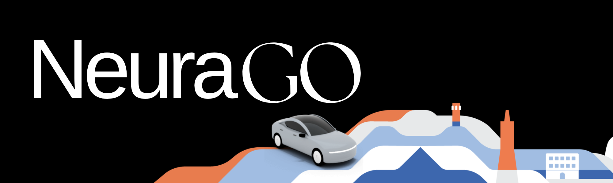

<div align="center">
	
	<h1>NeuraGo - Smart Urban Mobility</h1>
	
</div>

## 🚀 About NeuraGo

NeuraGo is a cutting-edge ride-hailing platform that connects passengers with drivers for seamless urban transportation. Built with modern technologies, it offers real-time tracking, secure payments, and an intuitive user experience for both riders and drivers.

### ✨ Key Features

- 🔐 Secure user authentication and authorization
- 📍 Real-time location tracking
- 🚗 Driver-passenger matching algorithm
- ⭐ Rating and review system

## 🛠️ Tech Stack

- **Backend**: Node.js, Express.js, MongoDB
- **Frontend**: React.js
- **Authentication**: JWT
- **Real-time Updates**: Socket.io
- **Maps**: Google Maps API

## 🏗️ Installation

1. Clone the repository:
	 ```bash
	 git clone https://github.com/ashwan1-yadav/NeuraGo.git
	 cd NeuraGo
	 ```

2. Install dependencies for backend:
	 ```bash
	 cd Backend
	 npm install
	 ```

3. Install dependencies for frontend:
	 ```bash
	 cd ../frontend
	 npm install
	 ```

4. Set up environment variables:
	 Create `.env` files in both backend and frontend directories:

	 Backend `.env`:
	 ```
	 PORT=3000
	 MONGODB_URL=your_mongodb_url
	 JWT_SECRET=your_jwt_secret
	 ```

	 Frontend `.env`:
	 ```
	 REACT_APP_API_URL=http://localhost:5173
	 REACT_APP_GOOGLE_MAPS_KEY=your_google_maps_key
	 ```

5. Start the development servers:

	 Backend:
	 ```bash
	 cd Backend
	 npm run dev
	 ```

	 Frontend:
	 ```bash
	 cd frontend
	 npm start
	 ```

## 🎯 Usage

1. Create an account or login
2. Set your pickup location and destination
3. Choose your ride type
4. Confirm and track your ride

## 👥 Contributing

Welcome contributors! Please follow these steps:

1. Fork the repository
2. Create your feature branch (`git checkout -b feature/AmazingFeature`)
3. Commit your changes (`git commit -m 'Add some AmazingFeature'`)
4. Push to the branch (`git push origin feature/AmazingFeature`)
5. Open a Pull Request


---

<div align="center">
	Made with ❤️ NeuraGo 
</div>
